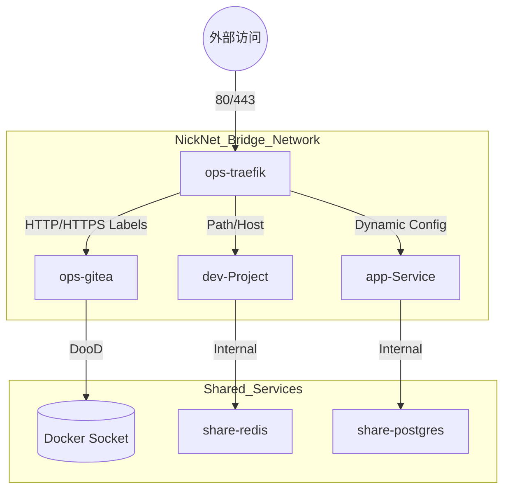
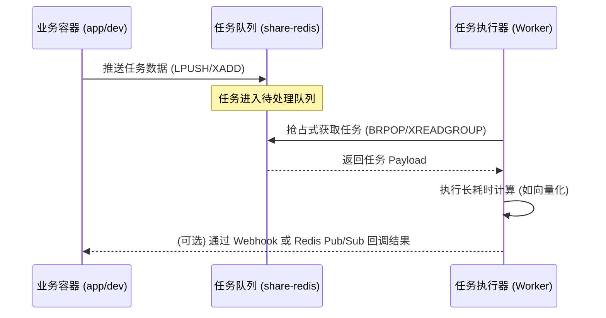

# 管理工程规范 (NickNet 核心架构)

---

## 1. Docker 规划

### 1.1 宿主机环境
宿主机直接安装 Docker Engine。禁止在宿主机直接安装语言运行时（Java, Node.js 等），所有执行环境均由容器提供。

### 1.2 服务分层隔离
系统所有容器严格遵循以下分层模型，每层在端口、内存及 OOM 优先级上相互隔离：

| 层级 | 容器名前缀 | 端口段 | 内存限制 | OOM 优先级 | 职责 |
|---|---|---|---|---|---|
| **底座层** | `ops-` | 3000-3999 | 共计 ≤ 500MB | 最高 (最后杀) | Traefik, Gitea, 日志栈 |
| **共享层** | `share-` | 5000-6999 | 软限制 | 次高 | 数据库, Redis, AI 模型服务 |
| **开发层** | `dev-` | 8000-9999 | ≤ 2GB | 最低 (优先杀) | 各项目 devcontainer 环境 |
| **业务层** | `app-` | 10000+ | 继承开发层 | 中 | 生产/测试业务容器 |

---

## 2. 核心网络 (NickNet) 与流量拓扑

系统唯一的通信骨干网络命名为 `nick-net`。流量流转模型如下：

---

## 3. 基础设施详解 (Infrastructure)

### 3.1 负载均衡与服务发现 (Traefik)
- **动态发现**：Traefik 监听 `/var/run/docker.sock`。服务只需在 `docker-compose.yaml` 的 `labels` 中声明路由规则，即可实现零配置上线。
- **证书管理**：自动申请 Let's Encrypt 泛域名或单域名证书，持久化于 `acme.json`。
- **外部接入**：通过 `mounts/ops/traefik/dynamic` 目录管理非 Docker 目标（如本地宿主机服务或外网 IP）。

### 3.2 源码托管与 CI/CD (Gitea)
- **DooD (Docker-outside-of-Docker)**：Gitea Actions Runner 挂载宿主机 Docker Socket。这种模式性能最高，且方便利用宿主机的镜像缓存。
- **流水线规范**：
  - 流水线定义：`.gitea/workflows/*.yaml`。
  - 交付物：所有流程最终必须构建为 Docker 镜像并推送至 Gitea 内置镜像仓库。

---

## 4. 异步任务机制 (Redis Task Cache)

针对“向量索引”、“大模型推理”等高耗时、高占用任务，设计专用的异步处理机制以防止系统阻塞。

### 4.1 任务流转模型

### 4.2 设计原则
1. **防阻塞**：Web API 接收到复杂请求后立即返回 `202 Accepted` 和 `task_id`，将任务转入 Redis。
2. **任务持久化**：使用 Redis Stream 或设置 RDB/AOF 开启，确保突发断电时任务不丢失。
3. **资源倾斜**：Worker 容器可配置独立的 `cpus` 和 `mem_limit`，防止其在计算时拖慢 Traefik 等关键底座。

---

## 5. 开发层 (dev) 规范
- **Workspace 映射**：宿主机 `/home/nick/WorkSpace/<项目>` 映射到容器内 `/workspace/<项目>`。
- **配置同步**：所有 devcontainer 统一种子挂载 `/etc/localtime` (时间同步) 和 `bash_history` (历史持久化)。
- **单一运行原则**：受内存限制，同一时刻仅允许运行一个 `dev-*` 容器。
