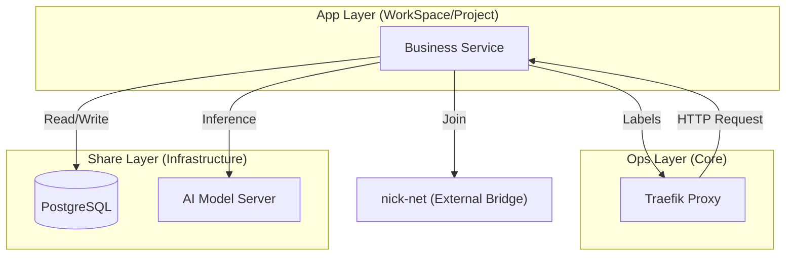

# 业务应用层设计文档 (APP_DESIGN)

业务应用层 (app) 承载实际交付的业务逻辑服务。与底座层和共享层不同，应用层采用了“去中心化、生命周期绑定”的设计原则。

## 1. 设计哲学：去中心化 (Decentralized)

应用层的核心特征是**高度解耦**。每个业务项目拥有独立的服务定义，不依赖全局统一的 Compose 文件。

### 1.1 目录结构与配置归属
- **配置位置**: 每个项目的 Docker 配置均存放于各自源码仓库的 `docker/` 目录下（例如：`WorkSpace/<Project>/docker/docker-compose.yaml`）。
- **环境隔离**: 业务容器的生命周期（启动、停止、重启）由对应项目的开发环境或部署流程全权负责，不干扰系统其他部分。

### 1.2 与开发层的关系
- **生命周期绑定**: 业务应用容器通常由开发层容器（devcontainer）通过 DooD (Docker-outside-of-Docker) 模式进行管理和测试。
- **配置一致性**: 业务容器使用的 `.env` 文件通常与开发环境共享，确保开发与生产环境在配置逻辑上的一致性。

## 2. 标准化接入规范

尽管应用层是去中心化的，但为了实现全系统的互联互通与自动化治理，所有业务容器必须遵循以下接入规则：

### 2.1 网络集成 (Network)
- **强制规则**: 所有业务容器必须接入 `nick-net` 外部网桥。
- **目的**: 确保业务容器能够透明地访问共享层 (share) 的数据库、消息队列以及 AI 推理服务。

### 2.2 服务发现与反向代理 (Traefik)
- **接入方式**: 业务应用不需要在 Compose 中直接暴露宿主机端口。
- **Traefik 标签**: 通过在 `docker-compose.yaml` 中添加特定的 `labels`，由底座层的 Traefik 自动发现并生成路由规则。
- **端口分配**: 业务服务端口原则上从 `10000` 开始起始分配，避免与底座层 (80-9000) 和共享层 (5000-6000) 冲突。

### 2.3 持久化路径 (Volumes)
- **数据路径**: 业务应用的持久化数据应尽可能挂载至项目自身的 `mounts/` 结构中，或者使用命名卷（Named Volumes）。
- **原则**: 严禁在业务容器中硬编码宿主机绝对路径，必须通过环境变量（如 `${PROJECT_DATA_DIR}`）进行引用。

## 3. 典型交互流程

## 4. 管理优先级
- **OOM 策略**: 业务应用层容器默认具有较低的 `oom_score_adj`（正值），在系统资源极其紧张时，业务容器会被优先终止，以优先保全 `ops` 底座和 `share` 数据层。
