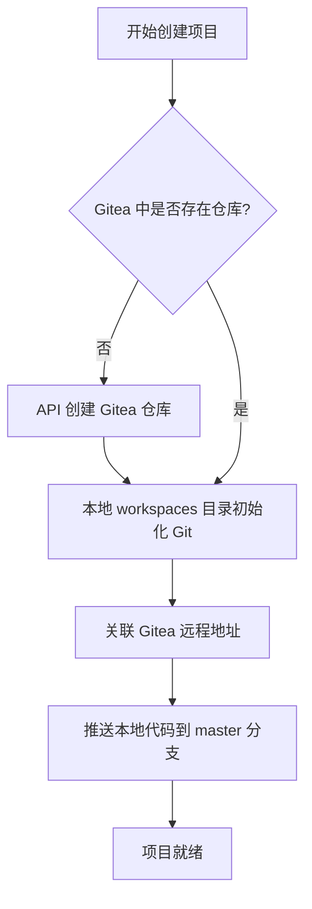

# Gitea 代码仓库管理设计文档

## 1. 概述

本项设计旨在实现开发环境的“云端化”与“零挂载”管理。通过 Gitea 作为中心化的源码托管平台，结合 Dev Container 的自动化生命周期脚本，消除宿主机与开发容器之间的物理目录挂载（Bind Mount），从而提高隔离性、一致性与可移植性。

## 2. 架构设计

### 2.1 存储架构
- **Persistence**: Gitea 数据持久化于 `${MNG_HOME}/volumes/ops/gitea`。
- **Source of Truth**: Gitea 内部仓库作为唯一的代码真源（Source of Truth）。
- **Workspace**: Dev Container 工作区目录（`/workspaces/<项目名>`）运行于容器内部层或 Docker 命名卷中，不与宿主机同步。
- **Mapping Logic**: 遵循 1:1:1 映射规范，即：1 开发项目 = 1 Gitea 仓库 = 1 GitHub 镜像。

### 2.2 网络协议
- **Internal**: Dev Container 通过 `nms` 内部网络使用容器名 `ops-gitea` 访问 API 和 Git 服务。
- **External**: 宿主机通过 `localhost:3000` (或 Traefik 反向代理的 `gitea.local`) 访问界面或进行初始同步。
- **Auth**: 统一使用 `GITEA_TOKEN`（AccessToken）进行认证。

---

## 3. 核心流程

### 3.1 项目初始化与代码同步流程



### 3.2 Dev Container 启动与拉取逻辑

当 IDE 附加到 Dev Container 时，执行以下自动化逻辑：

```mermaid
sequenceDiagram
    participant User as 用户 (IDE)
    participant Script as postCreateCommand
    participant Git as 容器 Git
    participant Gitea as Gitea 服务 (ops-gitea)

    User->>Script: 启动容器并附加
    Script->>Git: 检查 .git 目录是否存在
    alt 存在 (热启动)
        Git-->>User: 进入开发就绪状态
    else 不存在 (冷启动)
        Script->>Git: git init
        Script->>Git: 配置 safe.directory
        Script->>Gitea: git fetch (使用 Token)
        Gitea-->>Git: 返回代码流
        Git->>Script: git checkout master
        Script-->>User: 开发空间准备完毕
    end

### 3.3 外部镜像同步流程 (Gitea -> GitHub)

为了实现代码的多云备份与开源发布，Gitea 支持将本地仓库同步（镜像）至 GitHub。

```mermaid
graph LR
    Dev[开发者] -- git push --> Gitea[Gitea 仓库]
    Gitea -- 自动触发/定时同步 --> Mirror[Gitea Mirror 引擎]
    Mirror -- 使用 GitHub PAT 推送 --> GitHub[GitHub 远程仓库]
    
    subgraph "Gitea 内部逻辑"
        Gitea
        Mirror
    end
```

**同步机制说明：**
1. **推镜像 (Push Mirror)**：在 Gitea 仓库设置中配置远程 GitHub URL (包含 Token 或使用 SSH)。
2. **触发式同步**：每当 Gitea 收到新的 PUSH 时，会立即调度同步任务。
3. **安全准则**：
   - GitHub 侧建议使用 **Classic Personal Access Token (PAT)**，仅授予 `repo` 权限。
   - Token 存储在 Gitea 的 `Mirror Settings` 中，对普通用户不可见。
```

---

## 4. 管理规范

### 4.1 认证管理
- **环境变量**: `GITEA_TOKEN` 存储在 `${MNG_HOME}/env` 中。
- **注入机制**: 通过 `docker-compose.yaml` 的 `env_file` 注入 Gitea 服务，通过 `devcontainer.json` 的 `remoteEnv` 注入开发容器。

### 4.2 自动化脚本
- **create_project.sh**: 负责创建项目结构、生成 `devcontainer.json` 模板。
- **postCreateCommand**: 位于 `devcontainer.json` 中，确保无论容器如何漂移，代码都能正确拉取。

### 4.3 风险与持久化
- **重要提示**: 由于采用了“零挂载”模式，容器内的未提交更改在执行 `docker compose down` 或删除容器时会丢失。
- **规范**: 开发者**必须**在停止工作前执行 `git push` 到 Gitea。

### 4.4 分层过滤与数据安全规范

为了确保“零挂载”架构下的数据流动既高效又安全，系统实施了双重过滤机制。

#### 4.4.1 第一层：内网同步过滤 (Dev Container -> Gitea)

**场景**：开发者在容器内执行 `git push` 到内部 Gitea 仓库。
**机制**：主要通过项目根目录的 `.gitignore` 实现。
**原则**：禁止提交环境敏感文件、系统冗余文件及构建产物，保持内部真源纯净。

**标准忽略规则数据清单：**

```gitignore
### 1. 环境与秘钥 ###
.env
.env.local
env/
!env/template.env

### 2. VSCode 编辑器 ###
.vscode/*
!.vscode/extensions.json
!.vscode/settings.json

### 3. 系统冗余 ###
.DS_Store
Thumbs.db
*.tmp
*.bak

### 4. 语言与运行时产物 ###
node_modules/
__pycache__/
*.pyc
*.log
dist/
build/

### 5. 项目特定 (NickManage) ###
volumes/
data/
```

#### 4.4.2 第二层：外网镜像过滤 (Gitea -> GitHub)

**场景**：Gitea 自动将本地仓库同步至 GitHub 开源或备份。
**机制**：除了继承第一层的过滤结果外，还需注意以下安全与同步策略：
1. **二次脱敏**：如果某些文件被迫在内部提交（如内部测试配置），在 GitHub 同步中必须确保不包含此类内容。
2. **PUSH MIRROR 策略**：Gitea 镜像引擎仅同步 Git 对象（分支/Label），不涉及不包含在 Git 索引中的文件。
3. **敏感信息扫描**：建议在 Gitea 侧配置 Git Hook，在二次推送前通过 API 或扫描工具检查是否存在泄露的 Token。

---

## 5. 运维指南
- **数据备份**: 定期备份 `/home/nick/NickManage/volumes/ops/gitea`。
- **令牌续期**: 令牌过期或泄露后，需更新 `.env` 并重启相关服务。
